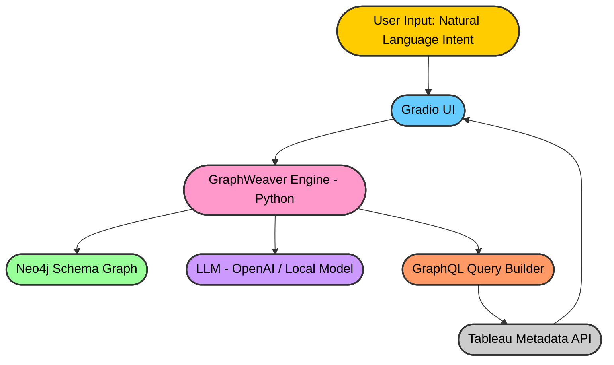

# ⚡ GraphWeaver

<p align="center">
  
  
  
</p>

## 🎯 Purpose

**GraphWeaver** is an AI-powered assistant that transforms **plain English user intents** into **valid GraphQL queries** for the **Tableau Metadata API**.
It leverages **Neo4j as a schema graph** and an **LLM for query orchestration**, enabling analysts and engineers to interact with Tableau metadata without needing deep GraphQL knowledge.

---

## 🌟 Benefits

* ✅ **Natural Language to GraphQL** – write “Get all dashboards for workbook *Sales*” and let GraphWeaver build the query.
* ✅ **Schema-Aware** – ensures generated queries respect Tableau’s Metadata API schema.
* ✅ **Validation & Correction** – automatically validates queries and retries corrections if needed.
* ✅ **Neo4j-powered** – schema relationships are stored as a graph for accurate traversal.
* ✅ **Optional cURL Execution** – test queries directly from the UI against your Tableau Metadata API.
* ✅ **Accessible UI** – powered by **Gradio**, with a modern, elite design.

---

## 🏗️ Architecture



* **Neo4j Schema Graph**: Stores GraphQL schema structure (types, fields, relations).
* **LLM**: Interprets user intent and generates candidate queries.
* **Validator**: Ensures query matches the schema and applies correction loops if needed.
* **UI**: Provides query output, error messages, and optional cURL execution.

---

## 🚀 Setup (Python Environment)

### 1. Clone the repo

```bash
git clone https://github.com/mok3bat/GraphWeaver.git
cd graphweaver
```

### 2. Create and activate a virtual environment

```bash
python3 -m venv venv
source venv/bin/activate   # Mac/Linux
venv\Scripts\activate      # Windows
```

### 3. Install dependencies

```bash
pip install --upgrade pip
pip install -r requirements.txt
```

### 4. Configure environment variables

Create a `.env` file:

```env
NEO4J_URI=bolt://localhost:7687
NEO4J_USER=neo4j
NEO4J_PASSWORD=yourpassword

LLM_API_KEY=your-openai-or-local-llm-key
LLM_BASE_URL=https://api.openai.com/v1
LLM_MODEL=gpt-4o-mini
```

### 5. Run the app

```bash
python app.py
```

App will be available at: 👉 [http://localhost:7860](http://localhost:7860)

---

## 🐳 Setup (Docker)

## 1. Prerequisites

Before running **GraphWeaver**, you’ll need:

* **Neo4j Database**

  * Either:

    * Sign up for a free **Neo4j AuraDB Sandbox**: [https://neo4j.com/cloud/platform/aura-graph-database/](https://neo4j.com/cloud/platform/aura-graph-database/)
    * Or run your own Neo4j instance locally.
  * Capture your connection details: `NEO4J_URI`, `NEO4J_USER`, `NEO4J_PASSWORD`.

* **OpenAI-Compatible LLM Endpoint**

  * You can use:

    * **OpenAI** directly (`https://api.openai.com/v1`)
    * Or any **OpenAI-compatible provider** such as:

      * **Ollama** (local models, e.g. `http://localhost:11434/v1`)
      * **LiteLLM** proxy
      * **Other hosted OpenAI-compatible APIs**

  * Capture your details: `LLM_BASE_URL`, `LLM_API_KEY`, and `LLM_MODEL`.

---

## 2. Environment Setup

Create a `.env` file in the project root:

```ini
# -------------------------
# Neo4j Connection
# -------------------------
NEO4J_URI=bolt://<your-neo4j-host>:7687
NEO4J_USER=neo4j
NEO4J_PASSWORD=<your-password>

# -------------------------
# LLM Provider (OpenAI API or compatible)
# -------------------------
LLM_API_KEY=<your-key-or-placeholder>
LLM_BASE_URL=https://api.openai.com/v1
LLM_MODEL=gpt-4o-mini

# -------------------------
# Optional: Model Settings
# -------------------------
LLM_TEMPERATURE=0
```

ℹ️ **Tip:**

* For **Neo4j Aura Sandbox**, copy the Bolt URI + credentials from the dashboard.
* For **Ollama**, you can set:

  ```ini
  LLM_BASE_URL=http://host.docker.internal:11434/v1
  LLM_API_KEY=ollama
  LLM_MODEL=mistral
  ```

---

## 3. Run with Docker

Build and start the app container:
```bash
docker build -t graphweaver .
```

```bash
docker run -it --rm -p 7860:7860 --env-file .env graphweaver
```
or using docker compose 
```bash
docker compose up --build
```

This will:

* Start **GraphWeaver** (Gradio app at `http://localhost:7860`)
* Connect to your external Neo4j instance (local or AuraDB sandbox).
* Use your configured LLM endpoint to generate queries.

---

## 4. Verify

Open your browser at:

👉 [http://localhost:7860](http://localhost:7860)

Enter a natural language request (e.g., *“List all workbooks by name”*) and check the generated GraphQL query.

---

## 🧑‍💻 Example Usage

* **User Input**:
  *“List all workbooks by name and ID.”*

* **GraphWeaver Output**:

  ```graphql
  query MyQuery {
    workbooksConnection(first: 10) {
      nodes {
        id
        name
      }
    }
  }
  ```

* **Optional cURL Execution**:
  Configure Tableau GraphQL endpoint in the UI and run the query directly.

---

## 📌 Roadmap

* [ ] Support multiple LLM backends (OpenAI, local models, Azure).
* [ ] Add schema visualization in UI (Neo4j → Network graph).
* [ ] Enhance retry logic with more advanced error correction.

---

## 📜 License

MIT License © 2025 – Made with ❤️ for analysts & engineers